# CLAUDE.md

## 变更记录 (Changelog)

**2025-09-14 22:43:47** - 架构文档自适应更新
- 新增模块结构图（Mermaid）
- 完善模块索引表格
- 更新AI使用指引和编码规范
- 添加覆盖率统计和续跑建议

---

本文件为 Claude Code (claude.ai/code) 提供该代码库的工作指导。

## 项目愿景

Select-MoE 是一个使用混合专家模型进行数据选择的框架，实现四阶段流水线：Warmup训练、Selection选择、Finetune微调、Evaluate评估。通过两层路由架构和GPU加速聚类算法，实现高质量训练数据的智能筛选。

## 架构总览

Select-MoE 采用分层解耦架构，核心组件包括：
- **两层路由架构**：质量门控 + MoE专家路由 + 垃圾专家处理
- **四阶段流水线**：预训练路由器 → 数据评分 → 聚类选择 → 目标模型微调
- **GPU加速聚类**：K-Means + Elbow方法 + 多GPU并行处理
- **多源数据支持**：本地数据集 + HuggingFace在线数据集

## 模块结构图

```mermaid
graph TD
    A["🏠 Select-MoE 根目录"] --> B["📦 src (源代码)"];
    A --> C["⚙️ configs (配置)"];
    A --> D["🔧 scripts (脚本)"];
    A --> E["📚 docs (文档)"];
    A --> F["🎯 examples (示例)"];

    B --> B1["🧠 models (核心模型)"];
    B --> B2["📊 data (数据处理)"];
    B --> B3["🔍 clustering (聚类算法)"];
    B --> B4["🎯 selection (数据选择)"];
    B --> B5["🚀 stages (四阶段流水线)"];
    B --> B6["🏋️ training (训练工具)"];
    B --> B7["🛠️ utils (工具函数)"];

    C --> C1["🏃 stage configs (各阶段配置)"];
    C --> C2["⚡ accelerate configs (加速器配置)"];
    C --> C3["🎯 model configs (模型配置)"];

    D --> D1["🎬 execution scripts (执行脚本)"];
    D --> D2["🔄 selection scripts (选择脚本)"];
    D --> D3["🔧 utility scripts (工具脚本)"];

    click B1 "./src/models/CLAUDE.md" "查看核心模型模块文档"
    click B2 "./src/data/CLAUDE.md" "查看数据处理模块文档"
    click B3 "./src/clustering/CLAUDE.md" "查看聚类算法模块文档"
    click B4 "./src/selection/CLAUDE.md" "查看数据选择模块文档"
    click B5 "./src/stages/CLAUDE.md" "查看四阶段流水线模块文档"
    click C "./configs/CLAUDE.md" "查看配置模块文档"
    click D "./scripts/CLAUDE.md" "查看脚本模块文档"
    click E "./docs/CLAUDE.md" "查看文档模块文档"
```



## 模块索引

| 模块路径 | 模块名称 | 职责描述 | 主要接口 | 覆盖率 |
|---------|---------|---------|----------|--------|
| `src/models` | 核心模型模块 | Select-MoE模型实现，两层路由架构 | `SelectMoeForCausalLM`, `SelectMoeConfig` | ⭐⭐⭐ |
| `src/data` | 数据处理模块 | 多源数据加载和预处理 | `load_and_prepare_dataset`, `encode_data` | ⭐⭐ |
| `src/clustering` | 聚类算法模块 | GPU加速聚类，支持多GPU并行 | `ClusterBasedSelection`, `GPUKMeansClustering` | ⭐⭐⭐ |
| `src/selection` | 数据选择模块 | 解耦的数据选择逻辑 | `cluster_based_selection`, `load_all_router_data` | ⭐⭐⭐ |
| `src/stages` | 四阶段流水线模块 | Warmup/Selection/Finetune/Evaluate | `warmup`, `selection`, `finetune` | ⭐⭐⭐ |
| `src/training` | 训练工具模块 | 全秩微调工具 | `setup_full_rank_training` | ⭐⭐ |
| `src/utils` | 工具函数模块 | 日志、配置、通用工具 | `setup_logging`, `hydra_resolvers` | ⭐⭐ |
| `configs` | 配置文件模块 | Hydra配置管理 | 各阶段YAML配置 | ⭐⭐⭐ |
| `scripts` | 执行脚本模块 | 各阶段执行和工具脚本 | Shell脚本 + Python脚本 | ⭐⭐⭐ |
| `docs` | 文档模块 | 项目文档和使用指南 | Markdown文档 | ⭐⭐ |

*覆盖率：⭐ 基础 ⭐⭐ 中等 ⭐⭐⭐ 完善*

## 运行与开发

### 环境设置
```bash
# 安装依赖
uv sync
source .venv/bin/activate

# 可选工具安装
./tools/install.sh
```

### 四阶段流水线执行
```bash
# Stage 1: 路由器预训练
CUDA_VISIBLE_DEVICES=0,1,2,3 bash scripts/run_stage_1.sh

# Stage 2: 路由器数据计算
CUDA_VISIBLE_DEVICES=0 bash scripts/run_stage_2.sh model_checkpoint_path=outputs/stage_1_warmup/YYYY-MM-DD/HH-MM-SS/full_rank_weights.pt

# Stage 2b: 聚类数据选择
CUDA_VISIBLE_DEVICES=0 uv run scripts/continue_selection.py router_data_dir=outputs/stage_2_selection/YYYY-MM-DD/HH-MM-SS/router_data

# Stage 3: 目标模型微调
CUDA_VISIBLE_DEVICES=0,1,2,3 bash scripts/run_stage_3.sh dataset.data_path=outputs/stage_2_selection/YYYY-MM-DD/HH-MM-SS/selected_data.jsonl

# Stage 4: 模型评估
bash scripts/eval.sh
```

### 参数覆盖示例
```bash
# 覆盖学习率和批次大小
bash scripts/run_stage_1.sh training.learning_rate=5e-5 training.batch_size=8

# 启用K-Means多GPU并行计算
bash scripts/run_stage_2.sh clustering_method=kmeans clustering_params.enable_parallel_kmeans=true clustering_params.parallel_processes=8
```

## 测试策略

### 代码质量检查
```bash
# 语法和样式检查
ruff check

# 自动格式化
ruff format
```

### 验证测试
```bash
# GPU聚类算法验证
python scripts/validate_gpu_silhouette.py

# 模型转换验证
python scripts/compare_converted_model.py --converted-model ./converted_models/select_moe_converted_OLMoE-1B-7B-0125
```

## 编码规范

- **Python版本**: >=3.12
- **代码风格**: 使用 `ruff` 进行检查和格式化
- **行长度**: 160字符
- **导入顺序**: 标准库 → 第三方库 → 本地模块
- **类型注解**: 推荐使用类型提示
- **文档字符串**: 使用中文描述，包含参数和返回值说明

## AI 使用指引

### 代码修改原则
- 优先编辑现有文件，避免创建新文件
- 修改代码前必须先使用 `ruff check` 和 `ruff format`
- 保持现有架构和接口兼容性
- 遵循项目的分层解耦设计

### 配置管理
- 使用 Hydra 进行参数管理和覆盖
- 配置文件采用 YAML 格式
- 支持命令行参数覆盖和多级配置组合

### 性能优化
- GPU 内存管理：使用适当的批次大小和梯度累积
- 多GPU支持：利用 FSDP/DDP 进行分布式训练
- 聚类加速：优先使用 GPU 加速的聚类算法

### 调试与日志
- 使用结构化日志记录关键信息
- 启用 `debug_print` 参数获取详细输出
- 利用 Hydra 的配置跟踪和实验管理