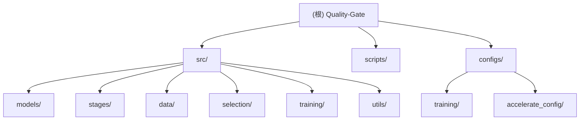

# Quality-Gate 项目文档

**更新时间**: 2025年10月23日 16:03:48 CST

## 变更记录 (Changelog)

### 2025-10-23
- 初始化项目 AI 上下文文档
- 创建根级和模块级 CLAUDE.md 文件
- 添加项目架构图和模块索引

---

## 项目愿景

Quality-Gate 是一个创新的数据选择框架，旨在通过质量门控机制筛选高质量训练数据，提升大语言模型的微调效果。项目的核心理念是：

1. **质量评估**: 在基座模型中插入质量门控层，学习判断数据质量
2. **数据筛选**: 基于质量评分和语义多样性选择训练数据
3. **高效微调**: 使用筛选后的数据对目标模型进行 LoRA 微调

本项目是对传统数据选择方法的改进，通过在模型架构层面集成质量评估机制，实现端到端的数据筛选流程。

---

## 架构总览

### 技术栈

- **语言**: Python 3.12+
- **深度学习框架**: PyTorch 2.6.0, Transformers 4.53.2
- **训练加速**: Accelerate 1.8.1, PEFT 0.16.0
- **配置管理**: Hydra-core
- **评估工具**: lm-eval 0.4.9
- **包管理**: uv (快速 Python 包管理器)

### 工作流程

项目分为三个主要阶段：

```
阶段1: 质量门控预热 (Warmup)
  ├─ 加载预转换的 Quality-Gate 模型
  ├─ 在小规模数据上训练质量门控参数
  └─ 输出: full_rank_weights.pt

阶段2: 数据选择 (Selection)
  ├─ 加载预热后的模型
  ├─ 对全量数据进行质量评分
  ├─ 收集质量门控 logits 和困惑度统计
  └─ 输出: router_data.pt (待后续筛选)

阶段3: 目标模型微调 (Finetune)
  ├─ 基于筛选数据训练目标模型
  ├─ 使用 LoRA 进行参数高效微调
  └─ 输出: LoRA 适配器检查点
```

---

## 模块结构图



---

## 模块索引

| 模块路径 | 职责描述 | 关键文件 |
|---------|---------|---------|
| `/src/models/` | Quality-Gate 模型架构定义 | `quality_gate_model.py`, `select_moe.py` |
| `/src/stages/` | 三阶段训练流程实现 | `warmup.py`, `selection.py`, `finetune.py` |
| `/src/data/` | 数据加载和预处理 | `dataset_loader.py` |
| `/src/selection/` | 数据选择算法 | `quality_scoring.py`, `selection_utils.py` |
| `/src/training/` | 训练辅助工具 | `full_rank_finetuning.py` |
| `/src/utils/` | 通用工具函数 | `logging_utils.py`, `hydra_resolvers.py`, `tools.py` |
| `/scripts/` | 转换和选择脚本 | `convert_qwen_to_quality_gate.py`, `batch_selection.py` |
| `/configs/` | Hydra 配置文件 | `stage_1_warmup.yaml`, `stage_2_selection.yaml`, `stage_3_finetune.yaml` |

---

## 运行与开发

### 环境准备

```bash
# 1. 安装 uv 包管理器
wget -qO- https://astral.sh/uv/install.sh | sh

# 2. 同步项目依赖
uv sync

# 3. 激活虚拟环境
source .venv/bin/activate
```

### 快速开始

#### 步骤 0: 模型转换

```bash
# 将 Qwen3 模型转换为 Quality-Gate 格式
uv run python scripts/convert_qwen_to_quality_gate.py \
    --model Qwen/Qwen3-1.7B \
    --save-path ./converted_models/quality_gate_Qwen3-1.7B
```

#### 步骤 1: 质量门控预热

```bash
# 单 GPU 训练
CUDA_VISIBLE_DEVICES=0 uv run python src/main.py \
    --config-name stage_1_warmup

# 多 GPU 训练
CUDA_VISIBLE_DEVICES=0,1,2,3 uv run python src/main.py \
    --config-name stage_1_warmup
```

#### 步骤 2: 数据选择

```bash
# 收集统计数据
CUDA_VISIBLE_DEVICES=0 uv run python src/main.py \
    --config-name stage_2_selection \
    model_checkpoint_path=outputs/stage_1_warmup/2025-10-23/12-00-00-...

# 执行数据筛选
CUDA_VISIBLE_DEVICES=0 uv run python scripts/batch_selection.py \
    root_dir=outputs/stage_2_selection/2025-10-23/12-30-00-...
```

#### 步骤 3: 目标模型微调

```bash
# 使用筛选数据微调
CUDA_VISIBLE_DEVICES=0,1,2,3 uv run python src/main.py \
    --config-name stage_3_finetune \
    dataset.data_path=outputs/stage_2_selection/.../selected_data.jsonl
```

### 参数覆写

项目使用 Hydra 配置管理，支持命令行参数覆写：

```bash
# 示例：覆写学习率和批次大小
uv run python src/main.py \
    --config-name stage_1_warmup \
    training.learning_rate=3e-4 \
    training.batch_size=32
```

---

## 核心概念

### Quality-Gate 模型架构

Quality-Gate 模型基于 Qwen3 架构，在每个 Transformer 层的 FFN 之前插入质量门控：

```python
# 质量门控层结构
class QualityGateDecoderLayer:
    def forward(hidden_states):
        # 1. 自注意力
        hidden_states = self.self_attn(hidden_states)

        # 2. 质量门控 (新增)
        quality_score, good_ratio = self.quality_gate(hidden_states)

        # 3. FFN
        hidden_states = self.mlp(hidden_states)

        return hidden_states, quality_score
```

**关键特性**:
- 质量门控输出单个分数，通过 sigmoid 得到 good_ratio
- 损失函数直接使用 good_ratio，鼓励降低低质量数据的评分
- 支持多种损失类型：linear (默认)
- 自动处理 padding tokens，避免填充数据影响训练

### 数据选择策略

阶段2收集统计数据后，使用独立脚本进行筛选：

1. **质量评分**: 每个样本获得质量门控分数和困惑度
2. **多样性保证**: 基于 MoE logits 进行语义聚类
3. **轮选策略**: 从各簇轮流选择高质量样本

---

## 测试策略

### 单元测试

目前项目尚未包含正式的单元测试套件，建议添加：
- 模型转换正确性测试
- 质量门控输出格式测试
- 数据加载和预处理测试

### 集成测试

通过完整的三阶段流程验证：
```bash
# 小规模端到端测试
uv run python src/main.py --config-name stage_1_warmup \
    dataset.subset_ratio=0.01 training.epochs=1
```

### 模型验证

使用 `lm-eval` 进行标准评测：
```bash
CUDA_VISIBLE_DEVICES=0 accelerate launch -m lm_eval \
    --model hf \
    --model_args pretrained=Qwen/Qwen2.5-1.5B,peft=outputs/stage_3_finetune/.../checkpoint-XXX \
    --tasks mmlu \
    --batch_size auto
```

---

## 编码规范

### Python 代码风格

项目使用 Ruff 进行代码检查和格式化：

```toml
[tool.ruff]
line-length = 160
exclude = ["ref_model"]

[tool.ruff.lint]
select = [
    "E",  # pycodestyle errors
    "F",  # pyflakes
    "W",  # pycodestyle warnings
    "I",  # isort
    "B",  # flake8-bugbear
    "A",  # flake8-builtins
]
ignore = ["E402"]
```

### 命名约定

- **模块名**: 小写下划线 (如 `quality_gate_model.py`)
- **类名**: 大驼峰 (如 `QualityGateForCausalLM`)
- **函数名**: 小写下划线 (如 `get_model_and_tokenizer`)
- **常量**: 大写下划线 (如 `QUALITY_GATE_PATTERNS`)

### 文档字符串

使用 Google 风格的 docstring：

```python
def convert_model(model_name: str, save_path: str) -> str:
    """
    将 Qwen3 模型转换为 Quality-Gate 格式

    Args:
        model_name: 源模型名称或路径
        save_path: 转换后模型保存路径

    Returns:
        保存路径的绝对路径

    Raises:
        ValueError: 如果模型类型不支持
    """
```

---

## AI 使用指引

### 与 Claude 协作

1. **阅读顺序**:
   - 先阅读 `/mnt/lishiwei/Quality-Gate/README.md` 了解项目概览
   - 再阅读模块级 CLAUDE.md 深入理解具体实现
   - 参考配置文件 `/mnt/lishiwei/Quality-Gate/configs/*.yaml` 了解参数

2. **常见任务**:
   - 修改模型架构: 参考 `/mnt/lishiwei/Quality-Gate/src/models/CLAUDE.md`
   - 调整训练流程: 参考 `/mnt/lishiwei/Quality-Gate/src/stages/CLAUDE.md`
   - 自定义数据处理: 参考 `/mnt/lishiwei/Quality-Gate/src/data/CLAUDE.md`

3. **调试提示**:
   - 启用质量损失调试: `training.quality_loss_debug=true`
   - 查看数据统计: 取消 `get_data_statistics()` 的注释
   - 使用小数据集快速验证: `dataset.subset_ratio=0.01`

### 模型开发指南

#### 添加新的质量损失函数

1. 在 `quality_gate_model.py` 的 `quality_classification_loss()` 中添加新类型
2. 更新配置文件中的 `training.quality_loss_type` 选项
3. 确保正确处理 `attention_mask`

#### 扩展数据选择算法

1. 在 `/mnt/lishiwei/Quality-Gate/scripts/` 中添加新的选择脚本
2. 参考 `batch_selection.py` 的结构
3. 确保输出格式与阶段3兼容 (JSONL 格式)

---

## 常见问题 (FAQ)

### Q: 为什么阶段2只收集统计数据，不直接筛选？

A: 为了解耦推理和筛选过程，提高灵活性：
- 推理阶段占用大量 GPU 内存
- 筛选阶段可以在 CPU 上进行实验
- 支持多种筛选策略的快速迭代

### Q: 如何选择合适的质量损失权重？

A: 建议范围 0.1 - 1.0：
- 太小：质量门控学习不充分
- 太大：影响语言建模损失，降低模型性能
- 默认值 0.5 - 1.0 通常效果较好

### Q: 能否使用其他基座模型？

A: 目前仅支持 Qwen3 系列：
- Qwen3-1.7B (推荐)
- Qwen3 其他规格
- 不支持 Qwen2/Qwen2.5 (架构不兼容)

### Q: 如何处理 OOM (Out of Memory) 错误？

A: 几种解决方案：
1. 减小批次大小: `training.per_device_batch_size=1`
2. 使用梯度检查点 (已默认启用)
3. 减小序列长度: `dataset.max_sequence_length=512`
4. 使用更大的 GPU 或多 GPU 训练

---

## 项目结构

```
Quality-Gate/
├── src/                    # 源代码
│   ├── models/            # 模型定义
│   ├── stages/            # 训练阶段
│   ├── data/              # 数据处理
│   ├── selection/         # 选择算法
│   ├── training/          # 训练工具
│   └── utils/             # 工具函数
├── scripts/               # 脚本工具
├── configs/               # 配置文件
├── dataset/               # 数据集 (gitignored)
├── outputs/               # 输出目录 (gitignored)
├── converted_models/      # 转换模型 (gitignored)
├── pyproject.toml         # 项目配置
├── README.md              # 项目说明
└── CLAUDE.md              # 本文件
```

---

## 相关资源

- **HuggingFace Transformers**: https://github.com/huggingface/transformers
- **PEFT 文档**: https://github.com/huggingface/peft
- **Hydra 配置**: https://hydra.cc/docs/intro/
- **lm-eval 评测**: https://github.com/EleutherAI/lm-evaluation-harness

---

## 贡献指南

### 提交代码前

1. 运行 Ruff 检查: `uv run ruff check .`
2. 格式化代码: `uv run ruff format .`
3. 测试核心功能: 运行小规模端到端测试
4. 更新文档: 如果修改了接口或配置

### Git 工作流

```bash
# 创建特性分支
git checkout -b feature/your-feature-name

# 提交更改
git add .
git commit -m "feat: 简短描述改动"

# 推送并创建 PR
git push origin feature/your-feature-name
```

---

## 许可证

Apache License 2.0

Copyright 2024 Quality-Gate Project. All rights reserved.
