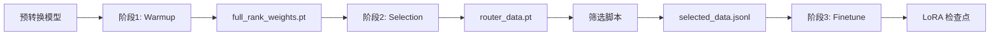

# src/stages 模块文档

[根目录](/mnt/lishiwei/Quality-Gate/CLAUDE.md) > [src](/mnt/lishiwei/Quality-Gate/src/) > **stages**

---

## 变更记录 (Changelog)

### 2025-10-23
- 初始化模块文档
- 记录三阶段训练流程实现

---

## 模块职责

`src/stages/` 模块实现 Quality-Gate 项目的三阶段训练流程：

1. **Warmup 阶段**: 预热质量门控参数
2. **Selection 阶段**: 收集质量评分和困惑度统计
3. **Finetune 阶段**: 使用筛选数据微调目标模型

每个阶段都是独立的、可配置的训练步骤，通过 Hydra 配置管理参数。

---

## 入口与启动

### 统一入口

所有阶段通过 `src/main.py` 启动：

```python
# src/main.py
@hydra.main(config_path="../configs", config_name="stage_1_warmup", version_base=None)
def main(cfg: DictConfig) -> None:
    if cfg.stage == "warmup":
        warmup(cfg)
    elif cfg.stage == "selection":
        selection.select(cfg)
    elif cfg.stage == "finetune":
        finetune.train(cfg)
```

### 命令行使用

```bash
# 阶段 1: Warmup
CUDA_VISIBLE_DEVICES=0 uv run python src/main.py \
    --config-name stage_1_warmup \
    training.learning_rate=3e-4

# 阶段 2: Selection
CUDA_VISIBLE_DEVICES=0 uv run python src/main.py \
    --config-name stage_2_selection \
    model_checkpoint_path=outputs/stage_1_warmup/.../

# 阶段 3: Finetune
CUDA_VISIBLE_DEVICES=0,1,2,3 uv run python src/main.py \
    --config-name stage_3_finetune \
    dataset.data_path=outputs/stage_2_selection/.../selected_data.jsonl
```

---

## 对外接口

### warmup.py

#### `warmup(cfg: DictConfig) -> None`
**功能**: 阶段1主函数，训练质量门控参数

**流程**:
1. 设置随机种子和日志系统
2. 加载预转换的 Quality-Gate 模型
3. 配置 PEFT 微调模式（LoRA 或 full_rank）
4. 加载和编码数据集
5. 配置 Trainer 并开始训练
6. 保存训练权重

**关键配置**:
```yaml
training:
  peft_mode: "full_rank"  # "lora" 或 "full_rank"
  learning_rate: 3e-4
  batch_size: 16
  epochs: 2
  quality_loss_weight: 1.0
```

**输出**:
```
outputs/stage_1_warmup/YYYY-MM-DD/HH-MM-SS-batch=16_lr=0.001.../
├── full_rank_weights.pt    # 质量门控权重（full_rank 模式）
└── checkpoint-XXX/         # LoRA 检查点（lora 模式）
```

#### `get_model_and_tokenizer(cfg: DictConfig) -> Tuple[QualityGateForCausalLM, AutoTokenizer]`
**功能**: 加载模型和分词器，配置质量损失参数

**关键操作**:
- 加载预转换的 Quality-Gate 模型
- 从配置覆写损失参数
- 启用 gradient checkpointing
- 调整 embedding 大小

#### `get_peft_config(cfg: DictConfig) -> LoraConfig`
**功能**: 生成 PEFT LoRA 配置

**返回**:
```python
LoraConfig(
    task_type=TaskType.CAUSAL_LM,
    r=16,
    lora_alpha=64,
    lora_dropout=0,
    target_modules=["quality_gate.gate"],
)
```

#### `validate_batch_size_configuration(...) -> int`
**功能**: 验证批次大小配置，计算梯度累积步数

**逻辑**:
```python
effective_batch_size = per_device_batch_size * world_size
gradient_accumulation_steps = total_batch_size // effective_batch_size
```

---

### selection.py

#### `select(cfg: DictConfig) -> None`
**功能**: 阶段2主函数，收集质量评分和困惑度统计

**流程**:
1. 加载预热后的 Quality-Gate 模型
2. 加载全量数据集
3. 对每个样本进行前向传播
4. 收集质量门控 logits 和困惑度
5. 保存统计数据为 `.pt` 文件
6. 释放模型和 GPU 内存

**关键配置**:
```yaml
model_checkpoint_path: "outputs/stage_1_warmup/.../full_rank_weights.pt"
data_process:
  batch_size: 32
dataset:
  shuffle: false
  sort_by_length: true  # 优化推理效率
```

**输出**:
```
outputs/stage_2_selection/YYYY-MM-DD/HH-MM-SS-.../
└── router_data/
    ├── openhermes_router_data.pt
    └── ...
```

#### `get_model_and_tokenizer(cfg: DictConfig) -> Tuple[QualityGateForCausalLM, AutoTokenizer]`
**功能**: 加载预转换模型并应用 Stage 1 训练的权重

**步骤**:
1. 从 `selector_model.path` 加载基础质量门控模型
2. 从 `model_checkpoint_path/full_rank_weights.pt` 加载训练权重
3. 设置模型为 eval 模式

#### `compute_token_perplexity(...) -> torch.Tensor`
**功能**: 计算每个 token 的困惑度

**公式**:
```
perplexity = exp(cross_entropy_loss)
```

**返回**: `[batch_size, seq_len]` 形状的困惑度张量

#### `load_router_data(router_data_path: str) -> dict`
**功能**: 加载保存的路由数据

**返回格式**:
```python
{
    "dataset_name": "openhermes",
    "num_samples": 270000,
    "quality_gates": torch.Tensor,  # [N, num_layers, max_seq_len]
    "perplexities": torch.Tensor,   # [N, max_seq_len]
    "sample_ids": List[str],        # 样本 ID 列表
    "max_seq_len": int,
}
```

#### `get_sample_router_info(router_data: dict, sample_id: str) -> dict`
**功能**: 根据样本 ID 获取对应的路由信息

**用途**: 用于分析特定样本的质量评分分布

---

### finetune.py

#### `train(cfg: DictConfig) -> None`
**功能**: 阶段3主函数，使用筛选数据微调目标模型

**流程**:
1. 加载目标模型（如 Qwen2.5-1.5B）
2. 配置 LoRA 微调
3. 加载筛选后的数据集或全量数据
4. 配置分布式训练参数
5. 使用 Trainer 进行微调
6. 保存 LoRA 适配器

**关键配置**:
```yaml
training:
  model:
    name: "Qwen/Qwen2.5-1.5B"
  peft_mode: "lora"
  lora:
    r: 128
    lora_alpha: 256
  batch_size: 64
dataset:
  mode: "subset"  # "full" 或 "subset"
  data_path: "outputs/stage_2_selection/.../selected_data.jsonl"
```

**输出**:
```
outputs/stage_3_finetune/YYYY-MM-DD/HH-MM-SS-.../
├── checkpoint-XXX/         # 中间检查点
│   ├── adapter_config.json
│   ├── adapter_model.safetensors
│   └── ...
└── checkpoint-final/       # 最终检查点
```

#### `get_model_and_tokenizer(cfg: DictConfig) -> Tuple[AutoModelForCausalLM, AutoTokenizer]`
**功能**: 加载标准 HuggingFace 模型和分词器

**注意**: 阶段3使用标准模型，不需要 Quality-Gate 架构

#### `get_peft_config(cfg: DictConfig) -> LoraConfig`
**功能**: 生成目标模型的 LoRA 配置

**目标模块**:
```python
# Qwen 系列
target_modules = ["q_proj", "k_proj", "v_proj", "o_proj",
                 "gate_proj", "up_proj", "down_proj"]

# LLaMA 系列
target_modules = ["q_proj", "k_proj", "v_proj", "o_proj",
                 "gate_proj", "up_proj", "down_proj"]
```

---

## 关键依赖与配置

### 阶段依赖关系



### 配置文件

#### stage_1_warmup.yaml
```yaml
stage: warmup
selector_model:
  path: "converted_models/quality_gate_Qwen3-1.7B"
dataset:
  dataset_from: "hf"  # "local" 或 "hf"
  subset_ratio: 0.025
training:
  peft_mode: "full_rank"
  learning_rate: 3e-4
  batch_size: 16
  quality_loss_weight: 1.0
```

#### stage_2_selection.yaml
```yaml
stage: selection
selector_model:
  path: "converted_models/quality_gate_Qwen2.5-1.5B"
model_checkpoint_path: "outputs/stage_1_warmup/.../full_rank_weights.pt"
dataset:
  subset_ratio: 1.0  # 使用全量数据
  sort_by_length: true
data_process:
  batch_size: 32
```

#### stage_3_finetune.yaml
```yaml
stage: finetune
training:
  model:
    name: "Qwen/Qwen2.5-1.5B"
  peft_mode: "lora"
  lora:
    r: 128
    lora_alpha: 256
dataset:
  mode: "subset"
  data_path: "outputs/stage_2_selection/.../selected_data.jsonl"
```

---

## 数据流

### 阶段1输入/输出

**输入**:
```python
# 从 HuggingFace 加载
{
    "messages": [
        {"role": "user", "content": "问题"},
        {"role": "assistant", "content": "回答"}
    ],
    "dataset": "openhermes",
    "id": "openhermes_12345"
}
```

**输出**:
```python
# full_rank_weights.pt
{
    "model_state_dict": OrderedDict(),  # 质量门控参数
    "tokenizer_name": "Qwen/Qwen3-1.7B",
}
```

### 阶段2输入/输出

**输入**: 阶段1的权重 + 全量数据集

**输出**:
```python
# router_data.pt
{
    "quality_gates": torch.Tensor,  # [N, num_layers, max_seq_len]
    "perplexities": torch.Tensor,   # [N, max_seq_len]
    "sample_ids": ["openhermes_1", "openhermes_2", ...],
    "dataset_name": "openhermes",
    "num_samples": 270000,
}
```

### 阶段3输入/输出

**输入**:
```jsonl
{"messages": [...], "dataset": "openhermes", "id": "openhermes_12345"}
{"messages": [...], "dataset": "openhermes", "id": "openhermes_67890"}
```

**输出**: LoRA 适配器权重

---

## 测试与质量

### 单阶段测试

**阶段1快速测试**:
```bash
uv run python src/main.py \
    --config-name stage_1_warmup \
    dataset.subset_ratio=0.01 \
    training.epochs=1
```

**阶段2测试（小批量）**:
```bash
uv run python src/main.py \
    --config-name stage_2_selection \
    data_process.batch_size=4 \
    dataset.subset_ratio=0.01
```

### 端到端测试

```bash
# 1. Warmup
uv run python src/main.py --config-name stage_1_warmup \
    dataset.subset_ratio=0.01 training.epochs=1

# 2. Selection (使用上一步的输出路径)
uv run python src/main.py --config-name stage_2_selection \
    model_checkpoint_path=outputs/stage_1_warmup/.../

# 3. 手动筛选数据
uv run python scripts/batch_selection.py root_dir=outputs/stage_2_selection/.../

# 4. Finetune
uv run python src/main.py --config-name stage_3_finetune \
    dataset.data_path=outputs/stage_2_selection/.../selected_data.jsonl \
    training.epochs=1
```

---

## 常见问题 (FAQ)

### Q: 为什么阶段1使用 full_rank 而不是 LoRA？

A:
- **full_rank**: 只微调质量门控参数（全秩），但不训练其他参数
- **lora**: 可以同时微调质量门控和部分模型参数
- 推荐使用 full_rank，因为我们只关心质量门控的学习

### Q: 阶段2为什么不直接输出筛选结果？

A: 为了解耦推理和筛选：
- 推理需要大量 GPU 内存
- 筛选可以在 CPU 上快速迭代
- 支持多种筛选策略的实验

### Q: 如何处理多数据集？

A: 阶段2会自动为每个数据集生成独立的 `router_data.pt`，然后使用 `batch_selection.py` 统一筛选：

```bash
uv run python scripts/batch_selection.py \
    root_dir=outputs/stage_2_selection/2025-10-23/12-00-00/ \
    selection_percentage=0.05
```

### Q: 阶段3能否使用全量数据？

A: 可以，通过设置 `dataset.mode="full"`：

```yaml
dataset:
  mode: "full"
  dataset_from: "hf"
  hf:
    datasets:
      - name: "teknium/OpenHermes-2.5"
        dataset_name: "openhermes"
```

### Q: 如何调整分布式训练配置？

A: 阶段3自动根据 GPU 数量选择训练模式：
- **单 GPU**: 常规训练
- **多 GPU**: FSDP (Fully Sharded Data Parallel)

手动配置 FSDP：
```python
# 在 finetune.py 的 FSDP_CONFIG 中添加新模型
FSDP_CONFIG = {
    "your-model/name": {
        "fsdp": "full_shard auto_wrap",
        "fsdp_transformer_layer_cls_to_wrap": "YourDecoderLayer",
    }
}
```

---

## 相关文件清单

```
src/stages/
├── __init__.py                    # 模块导出
├── warmup.py                      # 阶段1：质量门控预热
│   ├── warmup()                  # 主函数
│   ├── get_model_and_tokenizer() # 模型加载
│   ├── get_peft_config()         # PEFT 配置
│   └── validate_batch_size_configuration()
├── selection.py                   # 阶段2：数据选择
│   ├── select()                  # 主函数
│   ├── get_model_and_tokenizer() # 模型加载
│   ├── compute_token_perplexity() # 困惑度计算
│   ├── load_router_data()        # 加载路由数据
│   └── get_sample_router_info()  # 获取样本信息
└── finetune.py                    # 阶段3：目标模型微调
    ├── train() / finetune()      # 主函数
    ├── get_model_and_tokenizer() # 模型加载
    ├── get_peft_config()         # PEFT 配置
    └── validate_batch_size_configuration()
```

**相关配置**:
- `/mnt/lishiwei/Quality-Gate/configs/stage_1_warmup.yaml`
- `/mnt/lishiwei/Quality-Gate/configs/stage_2_selection.yaml`
- `/mnt/lishiwei/Quality-Gate/configs/stage_3_finetune.yaml`

---

## 开发指南

### 添加新的训练阶段

如需添加阶段4（如模型评估）：

1. 创建 `src/stages/evaluate.py`
2. 实现主函数 `evaluate(cfg: DictConfig)`
3. 在 `src/main.py` 中添加分支
4. 创建配置文件 `configs/stage_4_evaluate.yaml`

**模板**:
```python
# src/stages/evaluate.py
def evaluate(cfg: DictConfig) -> None:
    """阶段4：模型评估"""
    log = logging.getLogger(__name__)
    log.info("--- 开始阶段4：模型评估 ---")

    # 1. 加载模型
    model = load_finetuned_model(cfg)

    # 2. 运行评估
    results = run_evaluation(model, cfg)

    # 3. 保存结果
    save_results(results, cfg.output_dir)

    log.info("--- 阶段4完成 ---")
```

### 自定义数据加载

如需支持新的数据源：

1. 在 `src/data/dataset_loader.py` 中添加加载函数
2. 更新配置文件中的 `dataset.dataset_from` 选项
3. 在各阶段的数据加载逻辑中添加分支

### 调试技巧

**阶段1调试**:
```python
# 启用质量损失调试
model.config.quality_loss_debug = True

# 减小数据规模
dataset.subset_ratio = 0.001

# 禁用分布式训练
export WORLD_SIZE=1
```

**阶段2调试**:
```python
# 打印前3个样本的详细信息
if i == 0 and j < 3:
    log.info(f"Sample {j}:")
    log.info(f"  Quality gates: {quality_gates_sample.shape}")
    log.info(f"  Perplexity: {perplexity_sample.mean().item():.4f}")
```

**阶段3调试**:
```python
# 使用小批量测试
training.per_device_batch_size = 1
training.epochs = 1
dataset.subset_ratio = 0.01
```
